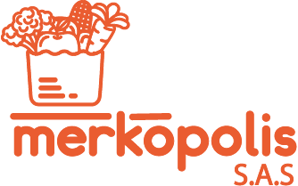

<!-- Improved compatibility of back to top link: See: https://github.com/othneildrew/Best-README-Template/pull/73 -->
<a name="readme-top"></a>
<!--
*** Thanks for checking out the Best-README-Template. If you have a suggestion
*** that would make this better, please fork the repo and create a pull request
*** or simply open an issue with the tag "enhancement".
*** Don't forget to give the project a star!
*** Thanks again! Now go create something AMAZING! :D
-->


<!-- PROJECT LOGO -->
<br />
<div align="center">
  <a href="https://github.com/largat12/curso-react-js">
    
  </a>
  <p align="center">
    <br />
    <a href="https://github.com/largat12/curso-react-js"><strong>Explore los documentos »</strong></a>
    <br />
    <br />
    <a href="https://github.com/largat12/curso-react-js">Ver Demo</a>
    ·
    <a href="https://github.com/largat12/curso-react-js/issues">Reportar Error</a>
  </p>
</div>


<!-- TABLE OF CONTENTS -->
<details>
  <summary>Contenidos</summary>
  <ol>
    <li>
      <a href="#sobre-el-proyecto">Sobre el proyecto</a>
      <ul>
        <li><a href="#construido">Construido</a></li>
      </ul>
    </li>
    <li>
      <a href="#instalacion">Instalación</a>
      <ul>
        <li><a href="#pre-requisitos">Pre-requisitos</a></li>
        <li><a href="#instalacion">Instalación</a></li>
      </ul>
    </li>
    <li><a href="#ejecutar-proyecto">Ejecutar proyecto</a></li>
    <li><a href="#lincecia">Lincencia</a></li>
  </ol>
</details>


<!-- ABOUT THE PROJECT -->
## Sobre el proyecto


Merkopolis es una empresa localizada en la ciudad de Medellín Colombia, que distribuye productos al por mayor a grandes supermercados y cadenas. Sus productos son 100% naturales, comprados directamente a los campesinos


<p align="right">(<a href="#readme-top">back to top</a>)</p>


### Construido

* [![React][React.js]][React-url]
* [![Bootstrap][Bootstrap.com]][Bootstrap-url]

<p align="right">(<a href="#readme-top">volver arriba</a>)</p>


<!-- GETTING STARTED -->
## Instalación

Para configurar el proyecto de manera local, realizar los siguientes pasos.

### Pre-requisitos

* npm
  ```sh
  npm install npm@latest -g
  ```

### Instalación


1. Clonar el repositorio
   ```sh
   git clone https://github.com/largat12/curso-react-js.git
   ```
2. Instalar paquetesNPM
   ```sh
   npm install
   ```


<p align="right">(<a href="#readme-top">volver arriba</a>)</p>


<!-- USAGE EXAMPLES -->
## Ejecutar proyecto

1. Clonar el repositorio
   ```sh
   npm start
   ```

<p align="right">(<a href="#readme-top">volver arriba</a>)</p>


<!-- LICENSE -->
## Licencia
`LICENSE.txt`

<p align="right">(<a href="#readme-top">volver arriba</a>)</p>


<!-- MARKDOWN LINKS & IMAGES -->
[issues-shield]: https://img.shields.io/github/issues/othneildrew/Best-README-Template.svg?style=for-the-badge
[issues-url]: https://github.com/othneildrew/Best-README-Template/issues
[product-screenshot]: images/screenshot.png
[Next.js]: https://img.shields.io/badge/next.js-000000?style=for-the-badge&logo=nextdotjs&logoColor=white
[Next-url]: https://nextjs.org/
[React.js]: https://img.shields.io/badge/React-20232A?style=for-the-badge&logo=react&logoColor=61DAFB
[React-url]: https://reactjs.org/
[Bootstrap.com]: https://img.shields.io/badge/Bootstrap-563D7C?style=for-the-badge&logo=bootstrap&logoColor=white
[Bootstrap-url]: https://getbootstrap.com
